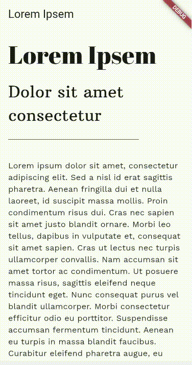

# Awesome Material3 UI

## This repository is not fully developed.
 
 

This repository contains a set of beautifully designed UI screens with Material UI. The UI have been designed complying with Google's Material 3 UI guidelines and have been implemented with Google's Flutter framework.

> These apps are cross-platform compatible and can be run on Android, iOS, Windows, Linux and macOS.

## Designed UIs
---
          